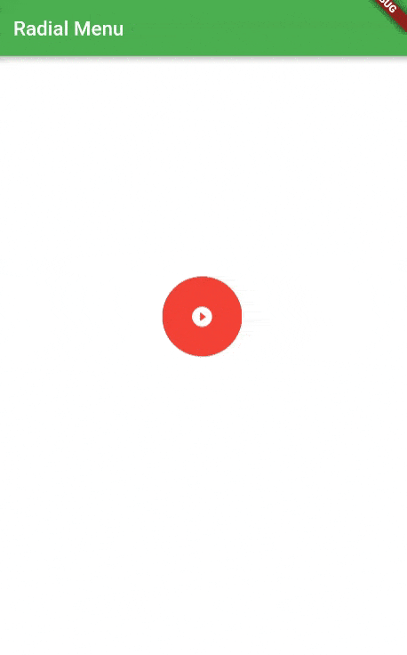

# Radial Menu for ios and android



# How to use it


```
import 'package:radialmenu/radial_menu.dart';
```
### create list of RadialMenuItem :
```
 List<RadialMenuItem> menuList =  [
        RadialMenuItem(
            title: "Item One", color: Colors.green, icon: Icons.access_alarm),
        RadialMenuItem(
            title: "Item Two", color: Colors.red, icon: Icons.account_box),
        RadialMenuItem(
            title: "Item Three", color: Colors.teal, icon: Icons.add_a_photo),
        RadialMenuItem(
            title: "Item Three", color: Colors.teal, icon: Icons.add_a_photo),
        RadialMenuItem(
            title: "Item Three", color: Colors.teal, icon: Icons.add_a_photo)
      ]
```
note:set the properties of RadialMenuItem title,color,icon.
```
return MaterialApp(
    theme: ThemeData(primarySwatch: Colors.green),
    home: RadialMenu(
      radius: 150,
      itemSize: 80,
      child: Scaffold(
        backgroundColor: Colors.white,
        appBar: AppBar(
          title: Text("Radial Menu"),
        ),
        body: Center(
            child:Container()
        ),
      ),
      onItemTapped: (i) {
        print("Item Tapped $i");
      },
      list:menuList
    ),
  );
  ```

